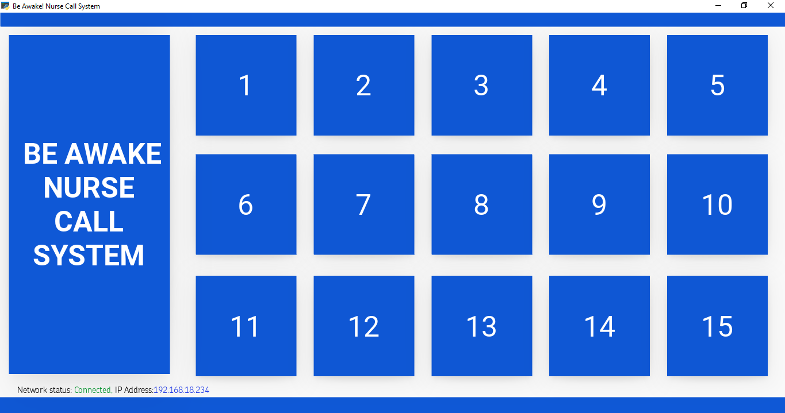

# Be Awake ! IP Hardwired Nurse Call System
An IP hardwired Nurse Call System based on WIZnet Ethernet HAT + Raspberry Pi Pico

### Windows Application

The Windows based application was made using Python's kivy framework.

Downaload Windows Application from <a href="https://github.com/amalmathewtech/be-awake-ip-hardwired-nurse-call-system/blob/main/windows_application/executable_file/setup.exe">here</a>

Documentation:https://www.hackster.io/amalmathewtech/be-awake-ip-hardwired-nurse-call-system-1eb97d

